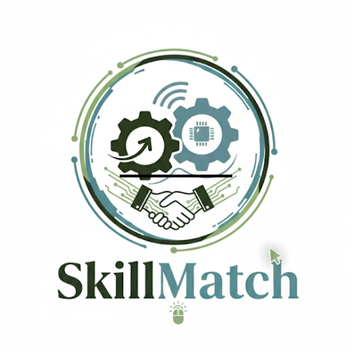

SkillMatch

  

Project Overview

SkillMatch is a web platform that works as a virtual board of freelancer profiles, designed to efficiently connect professionals and clients in the field of information technology and digital work. Our goal is to solve the lack of a specialized space to find and offer online services, making hiring and talent visibility easier.

What’s the Problem?

The digital job market lacks a centralized and specialized platform that directly connects digital freelancers with clients looking for specific skills. This creates friction and makes it difficult both to find talent and to promote services in areas such as programming, graphic design, and online consulting.

What’s the Solution?

The solution is SkillMatch, an intuitive and robust web platform that simplifies the search and hiring process. We provide a space where freelancers can showcase their profiles, portfolios, and rates, while clients can filter and find the ideal professional for their projects.

What are the Benefits?

Access to Specialized Talent: Clients can easily find and hire experts in digital and technological fields.

Visibility for Freelancers: Professionals have a dedicated space to showcase their expertise and effectively attract new clients.

Secure and Efficient Transactions: The integrated payment system, powered by Interledger, enables direct, fast, and secure transactions.

Work Flexibility: We encourage hiring professionals for specific projects, adapting to the new dynamics of remote work.

Architecture and Technologies

Technology Stack

Frontend: HTML and CSS for the structure and design of the user interface.

Backend: PHP for server logic, data handling, and user authentication.

Database: MySQL to store information about users, profiles, and projects.

Payments: Integration of the Interledger Wallet to handle payments.

Essential Features

User Authentication: Unified login system for freelancers and clients.

Search and Filtering: Tools for clients to find profiles by skills, name, or category.

Detailed Profile Pages: Complete sections with each freelancer’s portfolio, services, and rates.

Work Proposal System: A mechanism for clients to send project requests to freelancers.

Payment System: Integration with Interledger Wallet to process transactions securely.

Team and Responsibilities

Frontend Developer:

Responsibility: Design and build the user interface.

Tasks: Layout with HTML, styling with CSS, ensure responsive design and platform usability.

Backend Developer:

Responsibility: Implement server logic and data management.

Tasks: Write PHP code, configure the MySQL database, manage APIs, and integrate with the Interledger Wallet.

🇪🇸 Versión en Español
Resumen del Proyecto

SkillMatch es una plataforma web que funciona como una cartelera virtual de perfiles de freelancers, diseñada para conectar de manera eficiente a profesionales y clientes en el sector de tecnologías de la información y trabajos digitales. Nuestro objetivo es resolver la falta de un espacio especializado para encontrar y ofrecer servicios en el ámbito online, facilitando la contratación y la visibilidad del talento.

¿Cuál es el problema?

El mercado laboral digital carece de una plataforma centralizada y especializada que conecte de forma directa a freelancers digitales con clientes que buscan habilidades específicas. Esto genera fricción y dificulta tanto la búsqueda de talento como la promoción de servicios en campos como la programación, el diseño gráfico y la consultoría en línea.

¿Cuál es la solución?

La solución es SkillMatch, una plataforma web intuitiva y robusta que simplifica el proceso de búsqueda y contratación. Proporcionamos un espacio donde los freelancers pueden exhibir sus perfiles, portafolios y tarifas, mientras que los clientes pueden filtrar y encontrar al profesional ideal para sus proyectos.

¿Cuáles son los beneficios?

Acceso a Talento Especializado: Los clientes pueden encontrar y contratar fácilmente a expertos en áreas digitales y tecnológicas.

Visibilidad para Freelancers: Los profesionales tienen un espacio dedicado para mostrar su experiencia y atraer a nuevos clientes de manera efectiva.

Transacciones Seguras y Eficientes: El sistema de pagos integrado, a través de Interledger, facilita las transacciones directas, rápidas y seguras.

Flexibilidad Laboral: Fomentamos la contratación de profesionales para proyectos específicos, adaptándonos a las nuevas dinámicas del trabajo remoto.

Arquitectura y Tecnologías

Stack Tecnológico

Frontend: HTML y CSS para la estructura y el diseño de la interfaz de usuario.

Backend: PHP para la lógica del servidor, el manejo de datos y la autenticación de usuarios.

Base de Datos: MySQL para almacenar la información de usuarios, perfiles y proyectos.

Pagos: Se integrará la Interledger Wallet para gestionar los pagos.

Funciones Indispensables

Autenticación de Usuarios: Sistema de login unificado para freelancers y clientes.

Buscador y Filtrado: Herramientas para que los clientes encuentren perfiles por habilidades, nombre o categoría.

Páginas de Perfil Detalladas: Secciones completas con portafolio, servicios y tarifas de cada freelancer.

Sistema de Propuestas de Trabajo: Un mecanismo para que los clientes envíen solicitudes de proyectos a los freelancers.

Sistema de Pagos: Conexión con la Interledger Wallet para procesar transacciones de manera segura.

Equipo y Responsabilidades

Desarrollador Frontend:

Responsabilidad: Diseñar y construir la interfaz de usuario.

Tareas: Maquetación con HTML, estilos con CSS, asegurar la responsividad del diseño y la usabilidad de la plataforma.

Desarrollador Backend:

Responsabilidad: Implementar la lógica del servidor y la gestión de datos.

Tareas: Escribir el código PHP, configurar la base de datos MySQL, gestionar las APIs y la integración con la Interledger Wallet.
